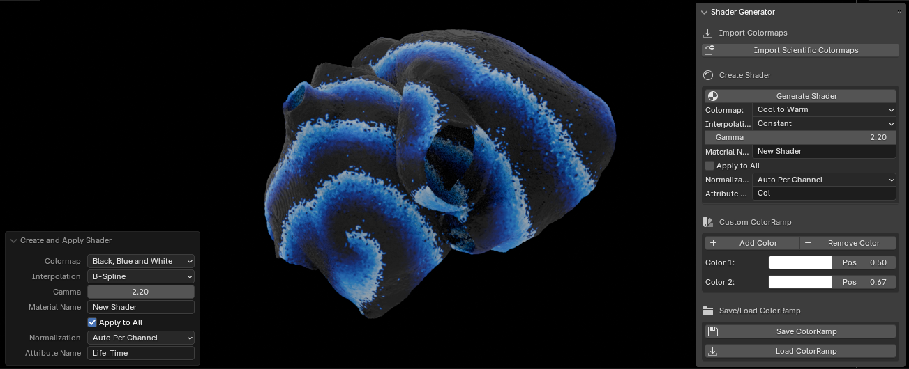

# SciBlend: Shader Generator for Blender v.2.2.0

This Blender add-on serves as a powerful shader generator, specifically designed for scientific visualizations. It allows users to create and apply customizable scientific ColorRamps to 3D objects, enhancing the visualization of data from various sources, including VTK files, Paraview exports, and any mesh with custom attributes.

## Table of Contents

1. [Requirements](#requirements)
2. [Features](#features)
3. [Install the Add-on](#install-the-add-on)
4. [Usage](#usage)
   - [Accessing the Add-on Panel](#1-accessing-the-add-on-panel)
   - [Creating a Shader](#2-creating-a-shader)
   - [Applying the Shader](#3-applying-the-shader)
   - [Customizing ColorRamps](#4-customizing-colorramps)
   - [Saving and Loading Shaders](#5-saving-and-loading-shaders)
5. [Tips for Best Results](#tips-for-best-results)
6. [Contributing](#contributing)

## Requirements

Before installing Blender and the add-on, ensure that you meet the following requirements:

1. **Operating System**: 
    - Any OS that supports Blender 4.2 (Windows, macOS, Linux)
  
2. **Blender**:
    - Blender 4.2 or higher

3. **Python**:
    - Python 3.11 (bundled with Blender 4.2)

## Features

- **Universal Attribute Mapping**: Apply shaders to any mesh attribute, not just colors. This makes it ideal for visualizing various scientific data types, including scalar fields, vector magnitudes, and more.
- **Scientific ColorRamps**: Choose from a variety of pre-defined scientific ColorRamps (viridis, plasma, inferno, etc.).
- **Custom Shaders**: Create, save, and load your own custom shaders with specialized ColorRamps.
- **Interpolation Options**: Select from different interpolation methods for smooth color transitions.
- **Flexible Application**: Apply shaders to all mesh objects or only selected ones.
- **Real-time Updates**: Dynamically update shaders without regenerating materials.
- **Paraview Integration**: Seamlessly modify colors of data imported from Paraview.
- **Scientific Visualization**: Designed specifically for enhancing scientific data representation in Blender.

## Install the Add-on

1. **Package the Script**:
    - Place all the provided script files into a folder named `ShaderGenerator`.
    - Compress this folder into a ZIP file. Make sure the ZIP file is also named `ShaderGenerator.zip`.

2. **Install the Add-on in Blender**:
    - Open Blender and go to `Edit > Preferences > Add-ons`.
    - Click on `Install...` and select the `ShaderGenerator.zip` file you just created.
    - Enable the add-on by checking the box next to `Shader Generator`.

3. **Using the Add-on**:
    - Access the add-on from the `View3D` panel under the `Shader Generator` tab.
    - Configure your shaders and apply them to your scientific data visualizations.
  

## Usage

After installation, the add-on can be used to generate and apply scientific shaders to any mesh with attributes:

1. **Accessing the Add-on Panel**:
   - Open Blender and switch to the `3D Viewport`.
   - In the right sidebar, locate the `Shader Generator` tab.

2. **Creating a Shader**:
   - Choose a predefined scientific ColorRamp or select 'Custom'.
   - Type the exact name of the attribute you want to visualize.
   - For custom shaders, use the '+' and '-' buttons to add or remove color stops.
   - Adjust colors and positions of each stop in the custom ColorRamp.

3. **Applying the Shader**:
   - Set the interpolation method (Constant, Linear, B-Spline, etc.).
   - Choose to apply to all mesh objects or only selected ones.
   - Click 'Create and Apply Scientific Shader' to generate the material.

4. **Customizing ColorRamps**:
   - Adjust the material name as needed.
   - Fine-tune custom ColorRamps by modifying individual color stops.

5. **Saving and Loading Shaders**:
   - Use 'Save Custom Shader' to store your creations.
   - Load previously saved shaders with 'Load Custom Shader'.

## Tips for Best Results

- Experiment with different ColorRamps to enhance the visual representation of your scientific data.
- Use custom shaders to highlight specific data ranges or features in your visualizations.
- Combine this add-on with Blender's material nodes for advanced effects and data representation.
- For temporal data from Paraview, consider using multiple shaders and animating between them in Blender.
- Utilize the real-time update feature to fine-tune your visualizations efficiently.

## Contributing

Contributions are welcome! Feel free to open issues or submit pull requests to improve this project.
